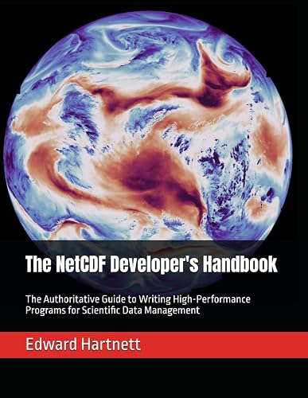
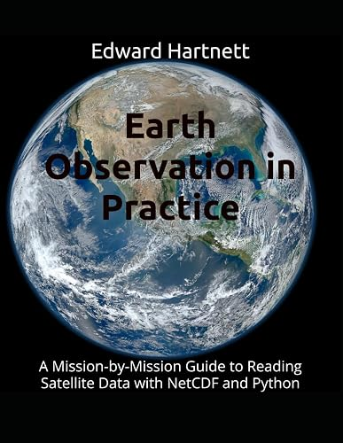

# The NetCDF Developer's Handbook

[](https://github.com/captainkirk99/NetCDF_Developers_Handbook/actions/workflows/ci.yml)
[](https://captainkirk99.github.io/NetCDF_Developers_Handbook/)

Example programs for the book by Edward Hartnett:

<p align="center">
  <a href="https://www.amazon.com/NetCDF-Developers-Handbook-Authoritative-High-Performance/dp/B0GYP4R5ZZ/">
    
  </a>
  <br>
  <a href="https://www.amazon.com/NetCDF-Developers-Handbook-Authoritative-High-Performance/dp/B0GYP4R5ZZ/"><b>The NetCDF Developer's Handbook</b></a>
  <br>
  The Authoritative Guide to Writing High-Performance Programs for Scientific Data Management
</p>

## What is here

The `examples/` directory contains the complete, working C and Fortran
programs discussed in *The NetCDF Developer's Handbook*: classic-model and
netCDF-4 files, groups, user-defined types, compression and chunking,
performance tuning, NcZarr, OPeNDAP and parallel I/O. Each example is a small
standalone program that writes (and usually reads back) a netCDF file, so it
can be run directly to see the concepts from the book in action.

[examples/README.md](examples/README.md) lists every program and what it
demonstrates; the Doxygen documentation of every source file is published at
<https://captainkirk99.github.io/NetCDF_Developers_Handbook/> (build it
locally with `doxygen Doxyfile`; output in `build/doxygen/html`). The
examples were moved here from the
[NetCDF Expansion Pack](https://github.com/Intelligent-Data-Design-Inc/NEP);
see [docs/roadmap.md](docs/roadmap.md) for how that was done and
[docs/nep-handoff.md](docs/nep-handoff.md) for the list of moved files.

## See also: Earth Observation in Practice

<a href="https://www.amazon.com/Earth-Observation-Practice-Mission-Mission/dp/B0HJRZ9F7L/">
  
</a>

For more netCDF examples, see my other book,
[*Earth Observation in Practice: A Mission-by-Mission Guide to Reading Satellite Data with NetCDF and Python*](https://www.amazon.com/Earth-Observation-Practice-Mission-Mission/dp/B0HJRZ9F7L/).
It reads real satellite data products with netCDF and Python, and has its own
example repository at
[captainkirk99/Earth_Observation_in_Practice](https://github.com/captainkirk99/Earth_Observation_in_Practice).
The examples in this repository are not related to that book.

<br clear="all">

## Building and running the examples

Requirements: CMake 3.18 or later, a C compiler, and netCDF-C (with HDF5)
installed so that `nc-config` can be found. For the Fortran examples you also
need a Fortran compiler and netCDF-Fortran (`nf-config`).

```sh
cmake -S . -B build -DNETCDF_PREFIX=/usr/local/netcdf-c -DHDF5_PREFIX=/usr/local/hdf5-2.1.1 \
      -DNETCDF_FORTRAN_PREFIX=/usr/local/netcdf-fortran
cmake --build build
ctest --test-dir build --output-on-failure
```

Omit `NETCDF_PREFIX` and `HDF5_PREFIX` if `nc-config` is already on your
`PATH` (for example when netCDF is installed from your distribution's
packages). `ctest` runs every example that does not need an external data
file.

The Fortran examples (`examples/f_classic`, `examples/f_netcdf-4`, and the
`f_*` programs in `nczarr`, `opendap` and `parallelIO`) are built
whenever `nf-config` is found, next to `nc-config` or under
`NETCDF_FORTRAN_PREFIX`; otherwise they are skipped with a status message.
Pass `-DENABLE_FORTRAN=OFF` to leave them out entirely.

The `examples/performance` programs `bzip2`, `lz4` and `zstandard` need the
matching HDF5 filter plugin. They build everywhere but print a "skipping"
message and exit successfully when the plugin cannot be loaded. To run them,
install the plugins (for example from the
[netcdf-c](https://github.com/Unidata/netcdf-c) `plugins/` directory, or the
[HDF5 filter plugins](https://github.com/HDFGroup/hdf5_plugins)) and point
`HDF5_PLUGIN_PATH` at the directory containing them before running `ctest`.
If netCDF-C was configured with `--with-plugin-dir`, the build finds that
directory through `nc-config --plugindir` and sets `HDF5_PLUGIN_PATH` for you.
`cache_tuning` runs its timing sweeps only when configured with
`-DENABLE_BENCHMARKS=ON`.

### Optional components: NcZarr, OPeNDAP, parallel I/O

These depend on how netCDF-C was configured; the build detects what is
available and skips the rest with a status message.

| Directory | Needs | Built | Run by `ctest` |
|---|---|---|---|
| `examples/nczarr` | `nc-config --has-nczarr` = yes | automatically | yes (local `file://*.zarr` stores) |
| `examples/opendap` | `nc-config --has-dap` = yes | automatically | only with `-DRUN_OPENDAP_EXAMPLES=ON` |
| `examples/parallelIO` | MPI + parallel netCDF-C | `-DENABLE_PARALLEL=ON` | yes, under `mpiexec -n 4` |

**NcZarr.** `nczarr_compression` needs the deflate filter plugin (see above)
and skips when it is missing or when netCDF-C was built without NcZarr filter
support (as Ubuntu's apt package is); `nczarr_enhanced` falls back to fixed-size
dimensions on netCDF-C releases before 4.9.3, which do not support unlimited
dimensions in NcZarr.

**OPeNDAP.** The programs read `sst.mnmean.nc.gz` from the public
[test.opendap.org](http://test.opendap.org) server, so they need network
access and are never run in CI. To run them yourself:

```sh
cmake -S . -B build -DRUN_OPENDAP_EXAMPLES=ON ...
cmake --build build
ctest --test-dir build -R opendap --output-on-failure
```

**Parallel I/O.** `square16_par` and `f_square16_par` must be run on exactly
four MPI ranks. Both need an MPI implementation; the C program also needs a
netCDF-C built with `--enable-parallel4`, found with `pkg-config`. On Ubuntu:

```sh
sudo apt-get install libopenmpi-dev libhdf5-openmpi-dev libnetcdf-mpi-dev
cmake -S . -B build -DENABLE_PARALLEL=ON
cmake --build build
ctest --test-dir build -R square16 --output-on-failure
```

The default `pkg-config` module is `netcdf-mpi` (Ubuntu's name); for a
self-built parallel netCDF-C pass `-DNETCDF_PARALLEL_PKG=netcdf` and put its
`lib/pkgconfig` on `PKG_CONFIG_PATH`. `f_square16_par` is built whenever
Fortran is enabled, but netCDF-Fortran has no way to report whether it was
linked against a parallel netCDF-C (Ubuntu's `libnetcdff-dev` is not), so its
run is only registered with `-DNETCDF_FORTRAN_PARALLEL=ON`. If Open MPI
crashes inside `hwloc` on a virtual machine, set `HWLOC_COMPONENTS=-x86`.

## License

See [LICENSE](LICENSE).
